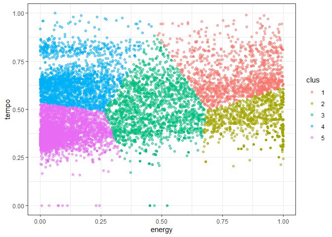
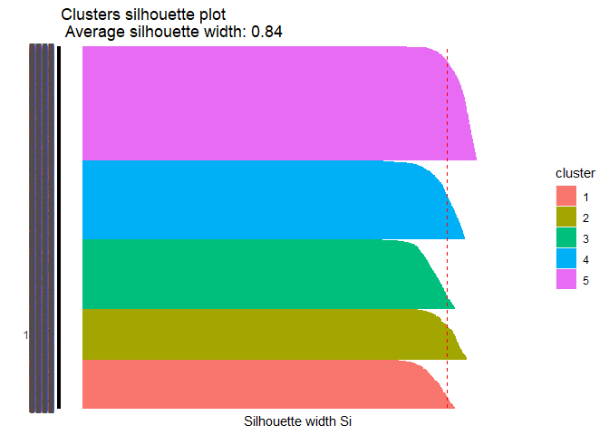
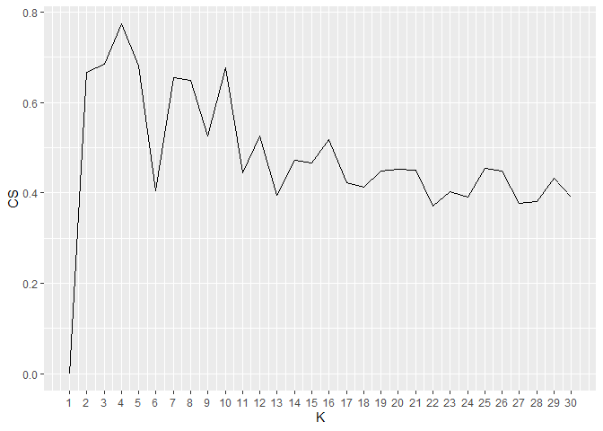
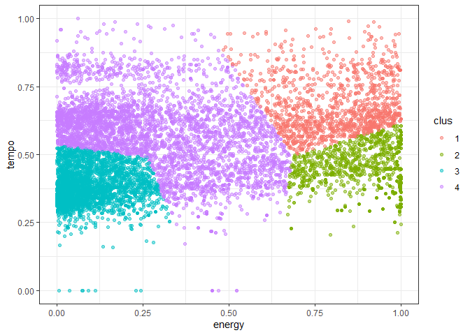

Proyecto 2 Data Mining
================
Diego Aguilar Dañobeitía
21/5/2021

## Cargar los datos

Lo primero que se tiene que hacer para iniciar el análisis de los datos
es cargar el archivo que los contiene, lo que se guardará en la variable
“data”:

``` r
setwd("D:/Documentos/Files & Stuff/U/Data Mining/Proyecto 2")

load("beats.RData")

head(beats)
```

    ##   artist_name              artist_id               album_id album_type
    ## 1        2Pac 1ZwdS5xdxEREPySFridCfh 1nGbXgS6toEOcFCDwEl5R3      album
    ## 2        2Pac 1ZwdS5xdxEREPySFridCfh 1nGbXgS6toEOcFCDwEl5R3      album
    ## 3        2Pac 1ZwdS5xdxEREPySFridCfh 1nGbXgS6toEOcFCDwEl5R3      album
    ## 4        2Pac 1ZwdS5xdxEREPySFridCfh 1nGbXgS6toEOcFCDwEl5R3      album
    ## 5        2Pac 1ZwdS5xdxEREPySFridCfh 1nGbXgS6toEOcFCDwEl5R3      album
    ## 6        2Pac 1ZwdS5xdxEREPySFridCfh 1nGbXgS6toEOcFCDwEl5R3      album
    ##   album_release_date album_release_year album_release_date_precision
    ## 1         2019-08-01               2019                          day
    ## 2         2019-08-01               2019                          day
    ## 3         2019-08-01               2019                          day
    ## 4         2019-08-01               2019                          day
    ## 5         2019-08-01               2019                          day
    ## 6         2019-08-01               2019                          day
    ##   danceability energy key loudness mode speechiness acousticness
    ## 1        0.656  0.882   0   -3.011    1      0.0941      0.03300
    ## 2        0.810  0.642   8   -8.647    1      0.2440      0.04800
    ## 3        0.548  0.590   4   -9.301    0      0.4750      0.11300
    ## 4        0.839  0.657   5   -4.959    0      0.2220      0.05260
    ## 5        0.854  0.694   0   -4.258    0      0.1230      0.00944
    ## 6        0.697  0.598   2   -9.604    1      0.1360      0.00522
    ##   instrumentalness liveness valence   tempo               track_id
    ## 1         0.000000   0.6700   0.782  91.661 6ayeqYtOtwVhqVB6k6MKoh
    ## 2         0.000000   0.2640   0.694  90.956 1UDsnzBp8gUCFsrzUDlZI9
    ## 3         0.000722   0.2290   0.267  87.841 3bKs15o7F9VP6GBExCbb6H
    ## 4         0.000106   0.3910   0.615  85.111 4L0iAst3yLonw8aGxTRCvb
    ## 5         0.071900   0.0767   0.776 104.379 66men3J5qFERvIY06M5hQ9
    ## 6         0.000000   0.1720   0.387  85.862 7GVCAVH7SZnjrzHI1FmfeA
    ##                                                       analysis_url
    ## 1 https://api.spotify.com/v1/audio-analysis/6ayeqYtOtwVhqVB6k6MKoh
    ## 2 https://api.spotify.com/v1/audio-analysis/1UDsnzBp8gUCFsrzUDlZI9
    ## 3 https://api.spotify.com/v1/audio-analysis/3bKs15o7F9VP6GBExCbb6H
    ## 4 https://api.spotify.com/v1/audio-analysis/4L0iAst3yLonw8aGxTRCvb
    ## 5 https://api.spotify.com/v1/audio-analysis/66men3J5qFERvIY06M5hQ9
    ## 6 https://api.spotify.com/v1/audio-analysis/7GVCAVH7SZnjrzHI1FmfeA
    ##   time_signature disc_number duration_ms explicit
    ## 1              4           1      347973    FALSE
    ## 2              4           1      241026    FALSE
    ## 3              4           1      240013    FALSE
    ## 4              4           1      295026    FALSE
    ## 5              4           1      241000    FALSE
    ## 6              4           1      224026    FALSE
    ##                                                 track_href is_local
    ## 1 https://api.spotify.com/v1/tracks/6ayeqYtOtwVhqVB6k6MKoh    FALSE
    ## 2 https://api.spotify.com/v1/tracks/1UDsnzBp8gUCFsrzUDlZI9    FALSE
    ## 3 https://api.spotify.com/v1/tracks/3bKs15o7F9VP6GBExCbb6H    FALSE
    ## 4 https://api.spotify.com/v1/tracks/4L0iAst3yLonw8aGxTRCvb    FALSE
    ## 5 https://api.spotify.com/v1/tracks/66men3J5qFERvIY06M5hQ9    FALSE
    ## 6 https://api.spotify.com/v1/tracks/7GVCAVH7SZnjrzHI1FmfeA    FALSE
    ##               track_name
    ## 1        California Love
    ## 2 Slippin' Into Darkness
    ## 3            Ride or Die
    ## 4     I Ain't Mad At Cha
    ## 5              Static II
    ## 6                Runnin'
    ##                                                                                             track_preview_url
    ## 1 https://p.scdn.co/mp3-preview/93e456ef0b73f23f50eeadaeaad852d79d4f4610?cid=ac26d97eca664234ab133e5208ea5737
    ## 2 https://p.scdn.co/mp3-preview/440595604d3f49464bcf28efc867f7df31d62e53?cid=ac26d97eca664234ab133e5208ea5737
    ## 3 https://p.scdn.co/mp3-preview/cc18dc90d609d37591e5993615a0cea1fa25f428?cid=ac26d97eca664234ab133e5208ea5737
    ## 4 https://p.scdn.co/mp3-preview/d138f0170423cd9a14f31006d4add57c07f705c4?cid=ac26d97eca664234ab133e5208ea5737
    ## 5 https://p.scdn.co/mp3-preview/dddb7d0ea0205338a00c591e6045b0c21cd7c9fc?cid=ac26d97eca664234ab133e5208ea5737
    ## 6 https://p.scdn.co/mp3-preview/fc169c99acc9d8bb19b34cf1aaad9f1b0b9b68e8?cid=ac26d97eca664234ab133e5208ea5737
    ##   track_number  type                            track_uri
    ## 1            1 track spotify:track:6ayeqYtOtwVhqVB6k6MKoh
    ## 2            2 track spotify:track:1UDsnzBp8gUCFsrzUDlZI9
    ## 3            3 track spotify:track:3bKs15o7F9VP6GBExCbb6H
    ## 4            4 track spotify:track:4L0iAst3yLonw8aGxTRCvb
    ## 5            5 track spotify:track:66men3J5qFERvIY06M5hQ9
    ## 6            6 track spotify:track:7GVCAVH7SZnjrzHI1FmfeA
    ##                                   external_urls.spotify      album_name
    ## 1 https://open.spotify.com/track/6ayeqYtOtwVhqVB6k6MKoh California Love
    ## 2 https://open.spotify.com/track/1UDsnzBp8gUCFsrzUDlZI9 California Love
    ## 3 https://open.spotify.com/track/3bKs15o7F9VP6GBExCbb6H California Love
    ## 4 https://open.spotify.com/track/4L0iAst3yLonw8aGxTRCvb California Love
    ## 5 https://open.spotify.com/track/66men3J5qFERvIY06M5hQ9 California Love
    ## 6 https://open.spotify.com/track/7GVCAVH7SZnjrzHI1FmfeA California Love
    ##   key_name mode_name key_mode
    ## 1        C     major  C major
    ## 2       G#     major G# major
    ## 3        E     minor  E minor
    ## 4        F     minor  F minor
    ## 5        C     minor  C minor
    ## 6        D     major  D major

``` r
str(beats)
```

    ## 'data.frame':    447622 obs. of  36 variables:
    ##  $ artist_name                 : chr  "2Pac" "2Pac" "2Pac" "2Pac" ...
    ##  $ artist_id                   : chr  "1ZwdS5xdxEREPySFridCfh" "1ZwdS5xdxEREPySFridCfh" "1ZwdS5xdxEREPySFridCfh" "1ZwdS5xdxEREPySFridCfh" ...
    ##  $ album_id                    : chr  "1nGbXgS6toEOcFCDwEl5R3" "1nGbXgS6toEOcFCDwEl5R3" "1nGbXgS6toEOcFCDwEl5R3" "1nGbXgS6toEOcFCDwEl5R3" ...
    ##  $ album_type                  : chr  "album" "album" "album" "album" ...
    ##  $ album_release_date          : chr  "2019-08-01" "2019-08-01" "2019-08-01" "2019-08-01" ...
    ##  $ album_release_year          : num  2019 2019 2019 2019 2019 ...
    ##  $ album_release_date_precision: chr  "day" "day" "day" "day" ...
    ##  $ danceability                : num  0.656 0.81 0.548 0.839 0.854 0.697 0.77 0.805 0.818 0.912 ...
    ##  $ energy                      : num  0.882 0.642 0.59 0.657 0.694 0.598 0.613 0.864 0.627 0.465 ...
    ##  $ key                         : int  0 8 4 5 0 2 1 11 11 7 ...
    ##  $ loudness                    : num  -3.01 -8.65 -9.3 -4.96 -4.26 ...
    ##  $ mode                        : int  1 1 0 0 0 1 0 0 1 1 ...
    ##  $ speechiness                 : num  0.0941 0.244 0.475 0.222 0.123 0.136 0.0585 0.183 0.184 0.36 ...
    ##  $ acousticness                : num  0.033 0.048 0.113 0.0526 0.00944 0.00522 0.00653 0.271 0.264 0.0585 ...
    ##  $ instrumentalness            : num  0.00 0.00 7.22e-04 1.06e-04 7.19e-02 0.00 2.83e-04 0.00 0.00 1.71e-05 ...
    ##  $ liveness                    : num  0.67 0.264 0.229 0.391 0.0767 0.172 0.276 0.389 0.132 0.0534 ...
    ##  $ valence                     : num  0.782 0.694 0.267 0.615 0.776 0.387 0.897 0.663 0.637 0.478 ...
    ##  $ tempo                       : num  91.7 91 87.8 85.1 104.4 ...
    ##  $ track_id                    : chr  "6ayeqYtOtwVhqVB6k6MKoh" "1UDsnzBp8gUCFsrzUDlZI9" "3bKs15o7F9VP6GBExCbb6H" "4L0iAst3yLonw8aGxTRCvb" ...
    ##  $ analysis_url                : chr  "https://api.spotify.com/v1/audio-analysis/6ayeqYtOtwVhqVB6k6MKoh" "https://api.spotify.com/v1/audio-analysis/1UDsnzBp8gUCFsrzUDlZI9" "https://api.spotify.com/v1/audio-analysis/3bKs15o7F9VP6GBExCbb6H" "https://api.spotify.com/v1/audio-analysis/4L0iAst3yLonw8aGxTRCvb" ...
    ##  $ time_signature              : int  4 4 4 4 4 4 4 4 4 4 ...
    ##  $ disc_number                 : int  1 1 1 1 1 1 1 1 1 1 ...
    ##  $ duration_ms                 : int  347973 241026 240013 295026 241000 224026 251000 276346 197013 314013 ...
    ##  $ explicit                    : logi  FALSE FALSE FALSE FALSE FALSE FALSE ...
    ##  $ track_href                  : chr  "https://api.spotify.com/v1/tracks/6ayeqYtOtwVhqVB6k6MKoh" "https://api.spotify.com/v1/tracks/1UDsnzBp8gUCFsrzUDlZI9" "https://api.spotify.com/v1/tracks/3bKs15o7F9VP6GBExCbb6H" "https://api.spotify.com/v1/tracks/4L0iAst3yLonw8aGxTRCvb" ...
    ##  $ is_local                    : logi  FALSE FALSE FALSE FALSE FALSE FALSE ...
    ##  $ track_name                  : chr  "California Love" "Slippin' Into Darkness" "Ride or Die" "I Ain't Mad At Cha" ...
    ##  $ track_preview_url           : chr  "https://p.scdn.co/mp3-preview/93e456ef0b73f23f50eeadaeaad852d79d4f4610?cid=ac26d97eca664234ab133e5208ea5737" "https://p.scdn.co/mp3-preview/440595604d3f49464bcf28efc867f7df31d62e53?cid=ac26d97eca664234ab133e5208ea5737" "https://p.scdn.co/mp3-preview/cc18dc90d609d37591e5993615a0cea1fa25f428?cid=ac26d97eca664234ab133e5208ea5737" "https://p.scdn.co/mp3-preview/d138f0170423cd9a14f31006d4add57c07f705c4?cid=ac26d97eca664234ab133e5208ea5737" ...
    ##  $ track_number                : int  1 2 3 4 5 6 7 8 9 10 ...
    ##  $ type                        : chr  "track" "track" "track" "track" ...
    ##  $ track_uri                   : chr  "spotify:track:6ayeqYtOtwVhqVB6k6MKoh" "spotify:track:1UDsnzBp8gUCFsrzUDlZI9" "spotify:track:3bKs15o7F9VP6GBExCbb6H" "spotify:track:4L0iAst3yLonw8aGxTRCvb" ...
    ##  $ external_urls.spotify       : chr  "https://open.spotify.com/track/6ayeqYtOtwVhqVB6k6MKoh" "https://open.spotify.com/track/1UDsnzBp8gUCFsrzUDlZI9" "https://open.spotify.com/track/3bKs15o7F9VP6GBExCbb6H" "https://open.spotify.com/track/4L0iAst3yLonw8aGxTRCvb" ...
    ##  $ album_name                  : chr  "California Love" "California Love" "California Love" "California Love" ...
    ##  $ key_name                    : chr  "C" "G#" "E" "F" ...
    ##  $ mode_name                   : chr  "major" "major" "minor" "minor" ...
    ##  $ key_mode                    : chr  "C major" "G# major" "E minor" "F minor" ...

``` r
dim(beats)
```

    ## [1] 447622     36

Por lo que se puede observar, existen 447622 datos con 36 atributos.

## Cargar las librerías

Luego, se procede a cargar las librerías necesarias:

``` r
library(tidyverse)
```

    ## Warning: package 'tidyverse' was built under R version 4.0.5

    ## -- Attaching packages --------------------------------------- tidyverse 1.3.0 --

    ## v ggplot2 3.3.3     v purrr   0.3.4
    ## v tibble  3.1.0     v dplyr   1.0.5
    ## v tidyr   1.1.3     v stringr 1.4.0
    ## v readr   1.4.0     v forcats 0.5.1

    ## Warning: package 'ggplot2' was built under R version 4.0.5

    ## Warning: package 'tibble' was built under R version 4.0.5

    ## Warning: package 'tidyr' was built under R version 4.0.5

    ## Warning: package 'readr' was built under R version 4.0.5

    ## Warning: package 'purrr' was built under R version 4.0.5

    ## Warning: package 'dplyr' was built under R version 4.0.5

    ## Warning: package 'stringr' was built under R version 4.0.5

    ## Warning: package 'forcats' was built under R version 4.0.5

    ## -- Conflicts ------------------------------------------ tidyverse_conflicts() --
    ## x dplyr::filter() masks stats::filter()
    ## x dplyr::lag()    masks stats::lag()

``` r
library(factoextra)
```

    ## Warning: package 'factoextra' was built under R version 4.0.5

    ## Welcome! Want to learn more? See two factoextra-related books at https://goo.gl/ve3WBa

``` r
library(flexclust)
```

    ## Warning: package 'flexclust' was built under R version 4.0.5

    ## Loading required package: grid

    ## Loading required package: lattice

    ## Loading required package: modeltools

    ## Loading required package: stats4

``` r
library(cluster)

library(R.utils)
```

    ## Warning: package 'R.utils' was built under R version 4.0.5

    ## Loading required package: R.oo

    ## Loading required package: R.methodsS3

    ## R.methodsS3 v1.8.1 (2020-08-26 16:20:06 UTC) successfully loaded. See ?R.methodsS3 for help.

    ## R.oo v1.24.0 (2020-08-26 16:11:58 UTC) successfully loaded. See ?R.oo for help.

    ## 
    ## Attaching package: 'R.oo'

    ## The following object is masked from 'package:R.methodsS3':
    ## 
    ##     throw

    ## The following objects are masked from 'package:modeltools':
    ## 
    ##     clone, dimension

    ## The following objects are masked from 'package:methods':
    ## 
    ##     getClasses, getMethods

    ## The following objects are masked from 'package:base':
    ## 
    ##     attach, detach, load, save

    ## R.utils v2.10.1 (2020-08-26 22:50:31 UTC) successfully loaded. See ?R.utils for help.

    ## 
    ## Attaching package: 'R.utils'

    ## The following object is masked from 'package:tidyr':
    ## 
    ##     extract

    ## The following object is masked from 'package:utils':
    ## 
    ##     timestamp

    ## The following objects are masked from 'package:base':
    ## 
    ##     cat, commandArgs, getOption, inherits, isOpen, nullfile, parse,
    ##     warnings

``` r
library(scales)
```

    ## Warning: package 'scales' was built under R version 4.0.5

    ## 
    ## Attaching package: 'scales'

    ## The following object is masked from 'package:purrr':
    ## 
    ##     discard

    ## The following object is masked from 'package:readr':
    ## 
    ##     col_factor

## Pre procesamiento de los datos

Se procede a limpiar los datos en base al objetivo: realizar una lista
de reproducción de 3 horas o más a partir de una sola canción, con las
canciones contenidas en “beats.Rdata”, tomando en cuenta las variables
que están en este archivo. Para esto, se van a tomar las variables de
“energy” y “tempo”, que son las que mayor similitud o diferencia pueden
mostrar entre canciones, musicalmente hablando, la variable
“external\_urls.spotify” para identificarlas, y la variable
“duration\_ms”, con la que vamos a determinar la duración de la lista de
reproducción.

### Eliminación de entidades duplicadas

Primero, se procede a eliminar entidades que poseen los mismos valores
para cada variable entre sí:

``` r
beatsunique <- unique(beats)

dim(beatsunique)
```

    ## [1] 446563     36

Se observa que disminuyó el número de entidades a 446563.

### Eliminación de entidades con valores faltantes

Luego se necesita limpiar las entidades que tienen valores faltantes
(NA) de los datos:

``` r
beatsclean <- na.omit(beatsunique)

dim(beatsclean)
```

    ## [1] 271748     36

Se observa que ahora existen 271748 datos, casi la mitad de los datos
anteriores

### Reducción de dimensionalidad

Después, según lo anterior, las únicas variables importantes serían las
de “energy”, “tempo”, “duration\_ms” y “external\_urls.spotify”, por lo
que se procede a eliminar las restantes:

``` r
beatsred <- beatsclean[c("energy", "tempo", "duration_ms", "external_urls.spotify")]

dim(beatsred)
```

    ## [1] 271748      4

Se observa que ahora se cuenta con los mismos 271748 datos, pero ahora
con sólo 4 variables, que son las que se necesitan.

### Sampleo

A continuación, se va a tomar una muestra de la data, debido a que por
el tamaño de esta no es posible llevar a cabo los procedimientos
analíticos siguientes. Se va a usar una muestra de tamaño 10,000.

``` r
beatsample <- sample_n(beatsred, 10000)
```

### Escalamiento

Luego, para un correcto análisis posterior, se va a escalar la variable
tempo.

``` r
beatsample$tempo = rescale(beatsample$tempo, to = c(0, 1))

beatsample %>% summary()
```

    ##      energy             tempo         duration_ms      external_urls.spotify
    ##  Min.   :0.000276   Min.   :0.0000   Min.   :   7826   Length:10000         
    ##  1st Qu.:0.087650   1st Qu.:0.3851   1st Qu.: 137266   Class :character     
    ##  Median :0.272000   Median :0.4953   Median : 204000   Mode  :character     
    ##  Mean   :0.387030   Mean   :0.5096   Mean   : 246807                        
    ##  3rd Qu.:0.681000   3rd Qu.:0.6175   3rd Qu.: 288240                        
    ##  Max.   :1.000000   Max.   :1.0000   Max.   :2822655

### Separación de la variable duration\_ms del resto

Finalmente, para que se pueda llevar a cabo el análisis, se debe separar
la variable correspondiente a la duración y a la url respecto a las que
se van a utilizar.

``` r
beatsinfo = beatsample[c("duration_ms", "external_urls.spotify")]

beatsanalize = beatsample[c("energy", "tempo")]

dim(beatsinfo)
```

    ## [1] 10000     2

``` r
dim(beatsanalize)
```

    ## [1] 10000     2

``` r
str(beatsanalize)
```

    ## 'data.frame':    10000 obs. of  2 variables:
    ##  $ energy: num  0.703 0.0195 0.612 0.114 0.607 0.928 0.356 0.146 0.735 0.114 ...
    ##  $ tempo : num  0.499 0.552 0.441 0.317 0.622 ...

## Análisis de los datos

Ya que se han limpiado y ordenado los datos de forma correcta, se
procede al análisis de este para resolver la problemática planteada en
este caso. Para generar la lista de reproducción, se va a realizar un
análisis de clusters de K-medias con las 2 variables seleccionadas,
tomando después como muestra aleatoria canciones pertenecientes al mismo
grupo o cluster que la canción en base a la cual se va a realizar dicha
lista, hasta completar las 3 horas.

Se va a realizar un primer intento del análisis K-medias con k = 5.

### Análisis cluster K = 5

``` r
beats_kmeans <- kmeans(beatsanalize, 5)

beatsanalize$clus <- beats_kmeans$cluster %>% as.factor()

ggplot(beatsanalize, aes(energy, tempo, color=clus)) +
   geom_point(alpha=0.5, show.legend = T) +
   theme_bw()
```

<!-- -->

``` r
info_clus <- beats_kmeans$centers

info_clus
```

    ##       energy     tempo
    ## 1 0.81301690 0.6779203
    ## 2 0.90228161 0.4427611
    ## 3 0.46214153 0.4930659
    ## 4 0.14194610 0.6454242
    ## 5 0.09716914 0.3828874

Se puede ver que existen 5 clusters no muy definidos entre sí dada la
naturaleza de los datos.

## Evaluación

Ahora vamos a evaluar nuestro análisis para mejorarlo y así lograr que
sea más preciso.

### Coeficiente de silueta

Se utilizará esta evaluación para el análisis.

``` r
beatsSil <- silhouette(beats_kmeans$cluster, dist(beatsanalize))
summary(beatsSil)
```

    ## Silhouette of 10000 units in 5 clusters from silhouette.default(x = beats_kmeans$cluster, dist = dist(beatsanalize)) :
    ##  Cluster sizes and average silhouette widths:
    ##      1361      1392      1936      2167      3144 
    ## 0.8147544 0.8497202 0.8093074 0.8391005 0.8776320 
    ## Individual silhouette widths:
    ##    Min. 1st Qu.  Median    Mean 3rd Qu.    Max. 
    ##  0.5629  0.8187  0.8483  0.8436  0.8771  0.9116

``` r
fviz_silhouette(beatsSil) + coord_flip()
```

    ##   cluster size ave.sil.width
    ## 1       1 1361          0.81
    ## 2       2 1392          0.85
    ## 3       3 1936          0.81
    ## 4       4 2167          0.84
    ## 5       5 3144          0.88

<!-- -->

Luego, se utiliza este para encontrar el mejor valor de k.

``` r
beatsSil=numeric(30)
for (k in 2:30){
  model <- kmeans(beatsanalize, centers = k)
  temp <- silhouette(model$cluster, dist(beatsanalize))
  beatsSil[k] <- mean(temp[,3])
}
tempDF=data.frame(CS=beatsSil,K=c(1:30))

ggplot(tempDF, aes(x=K, y=CS)) + 
  geom_line() +
  scale_x_continuous(breaks=c(1:30))
```

<!-- -->

Se observa que el mejor valor de k es 4, por lo que será el que
utilizaremos.

### Análisis cluster K = 4

``` r
beats_kmeans <- kmeans(beatsanalize, 4)

beatsanalize$clus <- beats_kmeans$cluster %>% as.factor()

ggplot(beatsanalize, aes(energy, tempo, color=clus)) +
   geom_point(alpha=0.5, show.legend = T) +
   theme_bw()
```

<!-- -->

``` r
info_clus <- beats_kmeans$centers

info_clus
```

    ##       energy     tempo    clus
    ## 1 0.81301690 0.6779203 1.00000
    ## 2 0.90228161 0.4427611 2.00000
    ## 3 0.09716914 0.3828874 5.00000
    ## 4 0.29303027 0.5735339 3.52815

## Creación de la lista de reproducción

Ahora, con los clusters definidos, se va a elegir una canción al azar y
a crear una playlist en base a esta, tomando elementos aleatorios de
esta hasta que se cumplan las 3 horas o más. Antes de esto, es necesario
fusionar la data de “beatsanalize” con la data de “beatsduration”.

### Fusión entre “beats\_kmeans” y “beatsduration”

``` r
beatsanalize$clus <- as.numeric(beatsanalize$clus)

beatsmerge <- merge(beatsanalize, beatsinfo, by = "row.names")

beatsmerge %>% summary()
```

    ##   Row.names             energy             tempo             clus      
    ##  Length:10000       Min.   :0.000276   Min.   :0.0000   Min.   :1.000  
    ##  Class :AsIs        1st Qu.:0.087650   1st Qu.:0.3851   1st Qu.:2.000  
    ##  Mode  :character   Median :0.272000   Median :0.4953   Median :3.000  
    ##                     Mean   :0.387030   Mean   :0.5096   Mean   :2.999  
    ##                     3rd Qu.:0.681000   3rd Qu.:0.6175   3rd Qu.:4.000  
    ##                     Max.   :1.000000   Max.   :1.0000   Max.   :4.000  
    ##   duration_ms      external_urls.spotify
    ##  Min.   :   7826   Length:10000         
    ##  1st Qu.: 137266   Class :character     
    ##  Median : 204000   Mode  :character     
    ##  Mean   : 246807                        
    ##  3rd Qu.: 288240                        
    ##  Max.   :2822655

### Selección de una canción al azar

Ahora se va a elegir una canción al azar para basarse en hacer la lista
de reproducción

``` r
songsample <- sample_n(beatsmerge, 1)

str(songsample)
```

    ## 'data.frame':    1 obs. of  6 variables:
    ##  $ Row.names            : 'AsIs' chr "2963"
    ##  $ energy               : num 0.0571
    ##  $ tempo                : num 0.844
    ##  $ clus                 : num 4
    ##  $ duration_ms          : int 207946
    ##  $ external_urls.spotify: chr "https://open.spotify.com/track/23zkOhlgtowAFGNZWZhlBE"

### Selección de canciones pertenencientes al mismo cluster

Luego, se van a separar las canciones que pertenecen al cluster de la
canción elegida de las demás

``` r
songcluster <- songsample[1, 4]

print(songcluster)
```

    ## [1] 4

``` r
beatscluster <- beatsmerge[beatsmerge$clus == songcluster, c("external_urls.spotify", "energy", "tempo", "duration_ms", "clus")]

beatscluster %>% summary()
```

    ##  external_urls.spotify     energy            tempo         duration_ms     
    ##  Length:4103           Min.   :0.00029   Min.   :0.0000   Min.   :  15373  
    ##  Class :character      1st Qu.:0.12300   1st Qu.:0.4913   1st Qu.: 133668  
    ##  Mode  :character      Median :0.29300   Median :0.5830   Median : 203586  
    ##                        Mean   :0.29303   Mean   :0.5735   Mean   : 243923  
    ##                        3rd Qu.:0.44500   3rd Qu.:0.6503   3rd Qu.: 284156  
    ##                        Max.   :0.67900   Max.   :1.0000   Max.   :2822655  
    ##       clus  
    ##  Min.   :4  
    ##  1st Qu.:4  
    ##  Median :4  
    ##  Mean   :4  
    ##  3rd Qu.:4  
    ##  Max.   :4

### Creación de la lista de reproducción

Ahora, podemos crear una lista de reproducción de al menos 3 horas con
estos datos. Procederemos a crearla

``` r
beatsplaylist <- sample_n(beatscluster, 200)

playlistduration <- sum(beatsplaylist$duration_ms)

playlisthours <- playlistduration/1.08e+7

print(playlisthours)
```

    ## [1] 4.626008

``` r
print(beatsplaylist$external_urls.spotify)
```

    ##   [1] "https://open.spotify.com/track/4rfIsu5DnC1pkE74S33Mnc"
    ##   [2] "https://open.spotify.com/track/4gPTlRLSZydE96MDROH9vo"
    ##   [3] "https://open.spotify.com/track/2oiq8N6lkd6ZdvMiWAGczR"
    ##   [4] "https://open.spotify.com/track/2JnDr9dMsmTYg5yiBE2cOr"
    ##   [5] "https://open.spotify.com/track/6ERhY1NEEMV19DdMhtiq3u"
    ##   [6] "https://open.spotify.com/track/5YcSe3Od6eBEdQWiZw8P3j"
    ##   [7] "https://open.spotify.com/track/5EWfBWKA1yRiDV3CV5Z7RT"
    ##   [8] "https://open.spotify.com/track/4DYLHbAZ7tuv6EaFHof45w"
    ##   [9] "https://open.spotify.com/track/4EaQ6RCM6PhLVPncHMabGw"
    ##  [10] "https://open.spotify.com/track/1D6XcPCh6PomNf21JnoDf4"
    ##  [11] "https://open.spotify.com/track/268mXFVcUQBlLvTrjbmiDX"
    ##  [12] "https://open.spotify.com/track/3sgfAfErW6hHDpWyKlUDRW"
    ##  [13] "https://open.spotify.com/track/7iePYhRP3Y8blbUXJ7Kz6m"
    ##  [14] "https://open.spotify.com/track/2WrZBupzsLBHFDCOFLoTie"
    ##  [15] "https://open.spotify.com/track/7LDoctNel6aNwTho1Sbyjt"
    ##  [16] "https://open.spotify.com/track/3SGPJvAQ9IT2knV4P6mXlk"
    ##  [17] "https://open.spotify.com/track/0gS9C9hzW3ywd4ZYW7X2TX"
    ##  [18] "https://open.spotify.com/track/25WQ4u87C46OTJclLcNXbU"
    ##  [19] "https://open.spotify.com/track/7mWNSiH4SC2rVUIiYhQGrR"
    ##  [20] "https://open.spotify.com/track/54xDjgjaz6EeL6ZEu7v5WP"
    ##  [21] "https://open.spotify.com/track/0pJp2mZ2cLxKIbUIBX9fgd"
    ##  [22] "https://open.spotify.com/track/2BpW6LlkGrkCiSbQd8gvcI"
    ##  [23] "https://open.spotify.com/track/3ZaFeqSJJHF22tCDSnIyqC"
    ##  [24] "https://open.spotify.com/track/2oBNkDsIkFrwd1JBb8v5XN"
    ##  [25] "https://open.spotify.com/track/6CzJUUkL1GxLIKYxwonWRO"
    ##  [26] "https://open.spotify.com/track/6uYZxqs6wAxOYpf6of4Ht1"
    ##  [27] "https://open.spotify.com/track/2RwXu6CWkzqPu321ci5310"
    ##  [28] "https://open.spotify.com/track/05Z2JqKejuY1msOLPl6nZa"
    ##  [29] "https://open.spotify.com/track/4mzB7AKBOJwYHLudiskwjb"
    ##  [30] "https://open.spotify.com/track/0axvmOqVcEQ9qFurqc8jcF"
    ##  [31] "https://open.spotify.com/track/7GnyYJaLjWYY13H9NaCuVL"
    ##  [32] "https://open.spotify.com/track/4Wl6m9cxko1qApO03cCENv"
    ##  [33] "https://open.spotify.com/track/2vg9aVu7kljqlsVFExIB0e"
    ##  [34] "https://open.spotify.com/track/5O6z2BS4A71wINnRa3zGO7"
    ##  [35] "https://open.spotify.com/track/07qQSblAls6rbqxiEGAAdV"
    ##  [36] "https://open.spotify.com/track/3SRVCptWrhlLyTQyixPGYE"
    ##  [37] "https://open.spotify.com/track/7BvmBRFQqBSE5f7ISgYDOm"
    ##  [38] "https://open.spotify.com/track/2Sa0DSWNbipDJHWO5rABmW"
    ##  [39] "https://open.spotify.com/track/2zDis33dp7xVuNxmfUBG1J"
    ##  [40] "https://open.spotify.com/track/0WPYjNLwaXUrZRb5oe0rkI"
    ##  [41] "https://open.spotify.com/track/7A27uJ8rcJXDYDuhwoaPxU"
    ##  [42] "https://open.spotify.com/track/4CnchvNoMSWqSZ1P9xBc1x"
    ##  [43] "https://open.spotify.com/track/45KkGT8B2GrmAbAggDyRmN"
    ##  [44] "https://open.spotify.com/track/6U0IE2GjbLrencPfvkXkcJ"
    ##  [45] "https://open.spotify.com/track/6FfF0cJ0LeF5bP7jOk615H"
    ##  [46] "https://open.spotify.com/track/1oqdPfQWwqn3rGVxxpECto"
    ##  [47] "https://open.spotify.com/track/53XLlgUMXfjIMBHUtW90Qq"
    ##  [48] "https://open.spotify.com/track/3ZLhCT0X6lKPjsNBjE9Cx0"
    ##  [49] "https://open.spotify.com/track/60tV4Z5fYZq6uHeIQcbGg8"
    ##  [50] "https://open.spotify.com/track/3QijK4bEg6dRqoOrfwFTYV"
    ##  [51] "https://open.spotify.com/track/2ZYGmb5sYy8mIaBaQcxA4B"
    ##  [52] "https://open.spotify.com/track/6jAQMDLDUvshmhN81YB5zk"
    ##  [53] "https://open.spotify.com/track/0kvWRe5vmo6xxbwZM9aFDT"
    ##  [54] "https://open.spotify.com/track/4J6IXrvuUjlhpuzgyLy9yV"
    ##  [55] "https://open.spotify.com/track/7aNymd76qYe8jQMRzXLGbD"
    ##  [56] "https://open.spotify.com/track/02TZxs0IqbA9sMtwBbDEOL"
    ##  [57] "https://open.spotify.com/track/6dGqEWbxAG5ahLkBBbMdQq"
    ##  [58] "https://open.spotify.com/track/22nsO49pyyKsuCGRafVqIn"
    ##  [59] "https://open.spotify.com/track/7izK7WYm5YgMLVG4zToHlq"
    ##  [60] "https://open.spotify.com/track/76lvAMxrtb2Cx3geyT7Tu3"
    ##  [61] "https://open.spotify.com/track/06UyToIwW0KFDjV57VWY4b"
    ##  [62] "https://open.spotify.com/track/4YzEk7v6GefyIOqT4NNHPy"
    ##  [63] "https://open.spotify.com/track/7D3ySA32CNVTvDrkwOsHCT"
    ##  [64] "https://open.spotify.com/track/7CQ0YRK4Vc5ixnEGItREJz"
    ##  [65] "https://open.spotify.com/track/4XYYhhlJmPP7Fnkn9NrcIV"
    ##  [66] "https://open.spotify.com/track/2Mei00I7xeAKBccmdTsspP"
    ##  [67] "https://open.spotify.com/track/7igZXPqcTPIhnjqzlsKNyw"
    ##  [68] "https://open.spotify.com/track/76G4B527g81KcIXOkYnMYe"
    ##  [69] "https://open.spotify.com/track/6hgABxVxZkvLlTxBF8ARow"
    ##  [70] "https://open.spotify.com/track/7JNC2o8s1hcJEFt9zsAIV4"
    ##  [71] "https://open.spotify.com/track/6Z4Vrk3WkXlvQsTCGetI9h"
    ##  [72] "https://open.spotify.com/track/3F6zpQ65grVLweVerXq69M"
    ##  [73] "https://open.spotify.com/track/6RKn118pPDeR6Hf4vv9Bmf"
    ##  [74] "https://open.spotify.com/track/7mBp32UPmSe9PiLHTZDjv6"
    ##  [75] "https://open.spotify.com/track/4thHdQoXCJp9mmVuO7kByl"
    ##  [76] "https://open.spotify.com/track/5B0AYVIYSdI1nzU1jZcG1p"
    ##  [77] "https://open.spotify.com/track/3dfsXpcBpomvuFBHmw8HXt"
    ##  [78] "https://open.spotify.com/track/4nr4C4uvHNpHJ0UNV0oQVr"
    ##  [79] "https://open.spotify.com/track/2j2WICWGyjgMTMf7vyj06l"
    ##  [80] "https://open.spotify.com/track/72y65ceyWnE3g1nXIGHXRd"
    ##  [81] "https://open.spotify.com/track/2krTxIFKWuxcddRWkFa5pP"
    ##  [82] "https://open.spotify.com/track/6GU19qDSbCWw5HKwfYTgVq"
    ##  [83] "https://open.spotify.com/track/32RalhAkxXt0usmD8qveI9"
    ##  [84] "https://open.spotify.com/track/5NUVAYCSHoaF93otxUPkOw"
    ##  [85] "https://open.spotify.com/track/4Bi1f3glyd4pcbzGRdyHbp"
    ##  [86] "https://open.spotify.com/track/5dMxALkKCi6sV9EQ2TQT56"
    ##  [87] "https://open.spotify.com/track/6mo8iNt2RxjYJByHCPCNEf"
    ##  [88] "https://open.spotify.com/track/0bLmBBk936qnzdUGmtLsxS"
    ##  [89] "https://open.spotify.com/track/7c1lluTIpYJSkG3bTAmwyq"
    ##  [90] "https://open.spotify.com/track/0QRpAeHNA1PF3I9iD3YoyF"
    ##  [91] "https://open.spotify.com/track/7ydHWTjMxhrDgIEZFEWJyZ"
    ##  [92] "https://open.spotify.com/track/5Dcwcdo5kVVjmyNqmhp8kp"
    ##  [93] "https://open.spotify.com/track/53F1tTScpM0NNopM7kYKJg"
    ##  [94] "https://open.spotify.com/track/1Gl2TzFb42TGSqpfV3Gojv"
    ##  [95] "https://open.spotify.com/track/3hih02McyYLexBC7gM8skW"
    ##  [96] "https://open.spotify.com/track/4J0CQZZIcwqBS60YQB1iKe"
    ##  [97] "https://open.spotify.com/track/2UVMQTJSSDyd5r5esjFcdz"
    ##  [98] "https://open.spotify.com/track/7BBg6ZpwfB1KVKEQehUbGl"
    ##  [99] "https://open.spotify.com/track/1TdfyCG1T4ZtaRqr0jE9Ge"
    ## [100] "https://open.spotify.com/track/0jgKErqvYYhI4n5mcK7bAB"
    ## [101] "https://open.spotify.com/track/070PEUFBDrijahmEHxkSSQ"
    ## [102] "https://open.spotify.com/track/29IGw29QgIQjxy1IdUKNeG"
    ## [103] "https://open.spotify.com/track/1j68JY5nQI0SR0VT91fiK7"
    ## [104] "https://open.spotify.com/track/68QC7cddFdSoxrBaeP7tpS"
    ## [105] "https://open.spotify.com/track/3fTQWszQ4baz3Ax2tMdUUG"
    ## [106] "https://open.spotify.com/track/70JlyahlOmJssIXxwAHtQA"
    ## [107] "https://open.spotify.com/track/2BTSg4VTlUt31rYIYN5Tmi"
    ## [108] "https://open.spotify.com/track/4bkXOkz8Ekrw8kMu7qP0ER"
    ## [109] "https://open.spotify.com/track/16JrQCDBVMGOOSNBd3inUV"
    ## [110] "https://open.spotify.com/track/4ML2pyXonKhWUnMBumL7PY"
    ## [111] "https://open.spotify.com/track/4CKLteSqrxO1oNEjA8sCQz"
    ## [112] "https://open.spotify.com/track/2OLN0aP2GiITZCTmgcIjRg"
    ## [113] "https://open.spotify.com/track/3budP8KyJj7DAX92ETJDad"
    ## [114] "https://open.spotify.com/track/3CBqW7J6KEA7AyvmNnYbQE"
    ## [115] "https://open.spotify.com/track/4aR5bcW1WDEM3zHB0JVuH5"
    ## [116] "https://open.spotify.com/track/0O8sVhrMF0nBxISpfz4RAj"
    ## [117] "https://open.spotify.com/track/2dtvQ6MM8dCX2MkFd58hFy"
    ## [118] "https://open.spotify.com/track/2biEYYUGz7HrJQoNF0d0VG"
    ## [119] "https://open.spotify.com/track/1ZcUXbPmrLifA4dgRxIrnE"
    ## [120] "https://open.spotify.com/track/6cJ1TjaLdzHA2Qobsni3ZB"
    ## [121] "https://open.spotify.com/track/0rQMohm2NKpVt79zGJT2VU"
    ## [122] "https://open.spotify.com/track/1ygxDaO4pM6rXPMpNZV3Ya"
    ## [123] "https://open.spotify.com/track/637860GB32BbYj3LjyXxh9"
    ## [124] "https://open.spotify.com/track/39UJa6FDPoiWi9zahdTYgi"
    ## [125] "https://open.spotify.com/track/5SH6dfNKMfi1m0ckaSVFHD"
    ## [126] "https://open.spotify.com/track/5k3r18w2hyQY0gUNvDaEgp"
    ## [127] "https://open.spotify.com/track/4IakCTttDWiMxb4BVg6VKa"
    ## [128] "https://open.spotify.com/track/7BP6C40kHTjxiw6LJEXyq5"
    ## [129] "https://open.spotify.com/track/2PaftQDWlO1mVi3zVPD9MP"
    ## [130] "https://open.spotify.com/track/3zucAjJ9J8wnArJNR8Ia8s"
    ## [131] "https://open.spotify.com/track/4u5JpNY5VpXimq2k5bOsSI"
    ## [132] "https://open.spotify.com/track/2j3vHBrKwuAfgGlQGm5mNb"
    ## [133] "https://open.spotify.com/track/5BYLMhfaufoiXucNqrEV2W"
    ## [134] "https://open.spotify.com/track/6Xd8eLa2bfSSsuMJgpR5At"
    ## [135] "https://open.spotify.com/track/2uoEEytj2zRbYKZBF2Ll1Q"
    ## [136] "https://open.spotify.com/track/3hODcPtx3SF21xOF6Datpd"
    ## [137] "https://open.spotify.com/track/22FX7P4bIHQ8Ae8nanjPwZ"
    ## [138] "https://open.spotify.com/track/1ICRDYP9RcidxleqaNFDr9"
    ## [139] "https://open.spotify.com/track/7E5brVAa6j1zFbWedz1vDT"
    ## [140] "https://open.spotify.com/track/2s2eo0Zck3qu0C6fRlzqfu"
    ## [141] "https://open.spotify.com/track/0MlMoFyOUnWZ9TARVVo502"
    ## [142] "https://open.spotify.com/track/6iyl3F67wgrigZekiUERnb"
    ## [143] "https://open.spotify.com/track/4cD7YiVBV7XsQdixthJ1y2"
    ## [144] "https://open.spotify.com/track/0tLRpo4KqwpIkr7zcCD34X"
    ## [145] "https://open.spotify.com/track/4KNPoie03yaCZobUjykA68"
    ## [146] "https://open.spotify.com/track/201V9thoh8nlkelTKfTl68"
    ## [147] "https://open.spotify.com/track/5WQJ1WxnVYt81q644x2qu6"
    ## [148] "https://open.spotify.com/track/5rohBsCKmXvRzNoUkXnjtr"
    ## [149] "https://open.spotify.com/track/6SDhHrn90TfAeIiCIFaA8N"
    ## [150] "https://open.spotify.com/track/6Ak6LCBenm2TG78ZinCy1z"
    ## [151] "https://open.spotify.com/track/6H3ofY25at01Dpvnv3JviL"
    ## [152] "https://open.spotify.com/track/6yJqgZB91d4DrBp1dBiLhz"
    ## [153] "https://open.spotify.com/track/0YAseE0pkGykBfoASAOqW6"
    ## [154] "https://open.spotify.com/track/0JJ1cVekVsO2U9MdfvjMhX"
    ## [155] "https://open.spotify.com/track/6z2HVggp7shFEz6Zrxkoz0"
    ## [156] "https://open.spotify.com/track/3zkLeCkHfEBOi9BEEo2ChF"
    ## [157] "https://open.spotify.com/track/3TOBHuSO3RXd8osI8IZlN3"
    ## [158] "https://open.spotify.com/track/36bctUEfCLwEK94hj4ZwHb"
    ## [159] "https://open.spotify.com/track/0ANMTicioDjWhZPSAlhPGV"
    ## [160] "https://open.spotify.com/track/571Oh0JsVgowGNZgO7ved9"
    ## [161] "https://open.spotify.com/track/3TPpZ3llfMDwPIvb0F73OT"
    ## [162] "https://open.spotify.com/track/1LphTizEHZyy0XFc2mv3DX"
    ## [163] "https://open.spotify.com/track/3u5BcwqtvcmMySM66AqjKS"
    ## [164] "https://open.spotify.com/track/2tsm70FHM9hLAlCECxxZpK"
    ## [165] "https://open.spotify.com/track/6qJ5f4pIp7xixDQvzXbitK"
    ## [166] "https://open.spotify.com/track/12ZrB5hqhZJJp6okFt67UP"
    ## [167] "https://open.spotify.com/track/0vU6FNj698eUOGLRT0yrbu"
    ## [168] "https://open.spotify.com/track/3COIKHwawKTPqxdQrpxsA8"
    ## [169] "https://open.spotify.com/track/5iCcQrOw3Hx0dGjkJ5PZug"
    ## [170] "https://open.spotify.com/track/2yLww32uDA78sU9zU5ajMk"
    ## [171] "https://open.spotify.com/track/0fY40LYGlg3yHnUozswqt5"
    ## [172] "https://open.spotify.com/track/2rilBmoyI8fqer3KTJnk9e"
    ## [173] "https://open.spotify.com/track/0pAinkM2iQ3sjcPPORDAyp"
    ## [174] "https://open.spotify.com/track/0FH0e0FCtPpnz4ON65zCMk"
    ## [175] "https://open.spotify.com/track/3vGrZjuckTAeaQZEoCMZ6c"
    ## [176] "https://open.spotify.com/track/6OUyaSAwls4zpPBbu7E2rV"
    ## [177] "https://open.spotify.com/track/2TpAKrClM22dfNeIgY68cR"
    ## [178] "https://open.spotify.com/track/6UTkHr6Xx4YpJujR9Kic7u"
    ## [179] "https://open.spotify.com/track/416c3jURpvkFibJWNs51tS"
    ## [180] "https://open.spotify.com/track/3X3rVwyK2GoGFRWeW9wUqF"
    ## [181] "https://open.spotify.com/track/06vJb259VJj9RnMOeu4anL"
    ## [182] "https://open.spotify.com/track/3dnSTm1HjrSL008562ufWt"
    ## [183] "https://open.spotify.com/track/4sH2VmXsDrIExlzXc4wls7"
    ## [184] "https://open.spotify.com/track/6qzSXalQKdwHDvGjm7dGHc"
    ## [185] "https://open.spotify.com/track/1qrodRAeiSJUf1NKF34XXs"
    ## [186] "https://open.spotify.com/track/3u4b5Dg0Cw3vWp1abbi4hJ"
    ## [187] "https://open.spotify.com/track/45UMTzxSbGNsJhaZEy0PSm"
    ## [188] "https://open.spotify.com/track/7rw46pMukPCaga95o83afY"
    ## [189] "https://open.spotify.com/track/6qXpgwMSbo8YofPK71flsy"
    ## [190] "https://open.spotify.com/track/7rzib6aRI9S4hPCWPfJB0l"
    ## [191] "https://open.spotify.com/track/4T63RL9kGECFGhavUAsKJY"
    ## [192] "https://open.spotify.com/track/5vHgkVEICNUP1PtwAYkEYi"
    ## [193] "https://open.spotify.com/track/3Ywup2iKKDQzeOPbT0diAC"
    ## [194] "https://open.spotify.com/track/3hhTMCOr0813fE0coFfj0C"
    ## [195] "https://open.spotify.com/track/0IwIBMSpGDHVxVDJgVr4Fg"
    ## [196] "https://open.spotify.com/track/3K0vUiZNaeJTLDK4GUicl9"
    ## [197] "https://open.spotify.com/track/59Z0lQnKncwuJPbxWxGBv8"
    ## [198] "https://open.spotify.com/track/43UsYISQNmy64ml4h8YmSI"
    ## [199] "https://open.spotify.com/track/1qifnvz0acc0pilrSOxT5R"
    ## [200] "https://open.spotify.com/track/6xfi6PMoLaKRBZ1WUSD01H"

Aquí se tiene impresa en pantalla la lista de reproducción con todos los
links necesarios, la que dura más de 3 horas.

## Conclusión

Se obtuvo una playlist de más de 3 horas con canciones similares a una
canción tomada al azar, tomando como variables para la generación de
grupos separados y definidos el tempo y la energía de cada canción.
